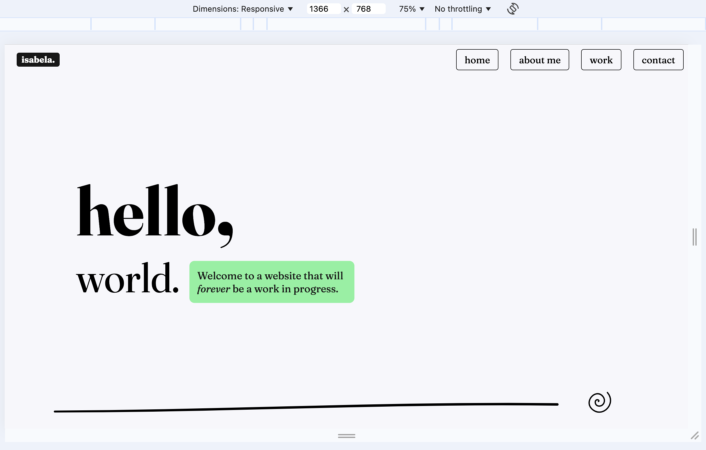
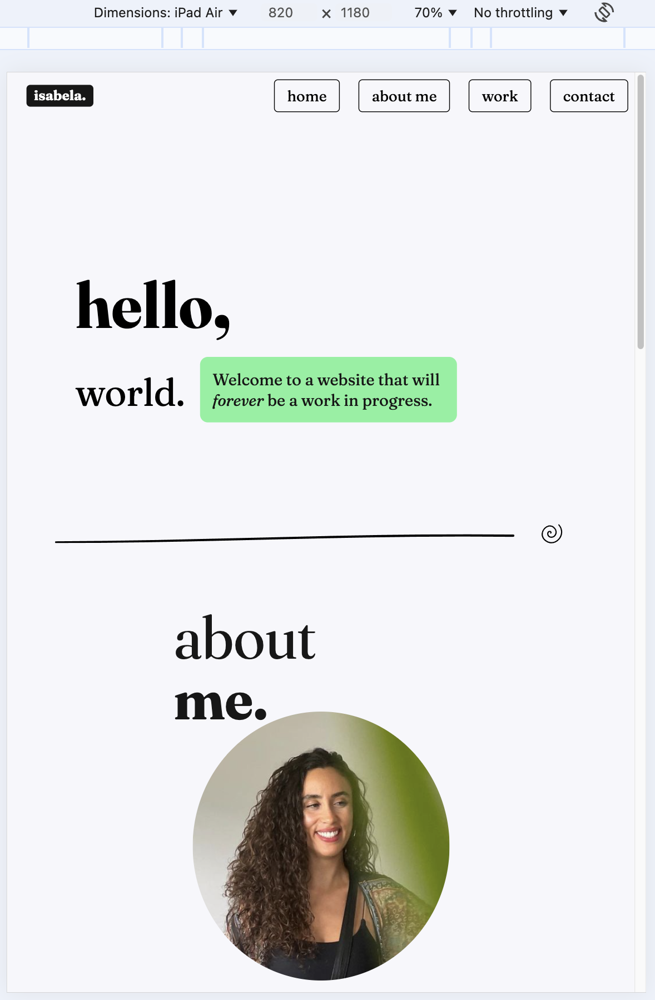
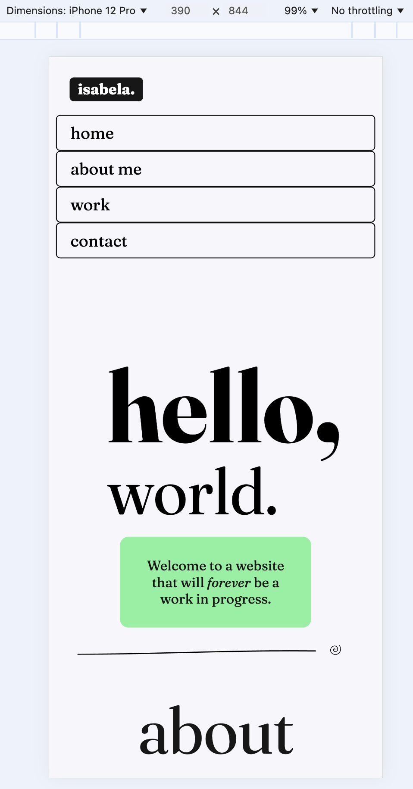

# Isabela Alcantara - Portfolio Task

[My Portfolio Site](https://isabelaalcantara1.github.io/) 👾

Welcome to the repository of my very first portfolio website! This project marks the beginning of my journey into web development. It's simple now, but with every bit of code, soon it will grow to something majestic.

## Table of Contents

- [About](#about)
- [Features](#features)
- [Technologies Used](#technologies-used)
- [Contributing](#contributing)
- [Contact](#contact)

## About

Hi, I'm Isabela 👋 Over three decades trying new things, excelling in some and failing terribly in others. My latest 'big thing' is the endeavour of becoming a full-stack developer. This website is a testament to my learning journey. It's a work in progress, a living document of my skills and creativity as they develop over time.

## Features

- **Responsive design**: Ensuring a seamless experience on both desktop and mobile devices.
- **Clean aesthetic**: Clean and minimalistic design to highlight content without distractions.
- **Easy navigation**: Simple and intuitive navigation to guide visitors through the site.
- **Dynamic content**: Sections for "About Me," "Work," and "Contact" with links to my social profiles and resume.

## Technologies Used

- **HTML5**: For structuring the content on the web.
- **CSS3**: For styling the website and creating responsive layouts.

  
## Screenshots

### Desktop

_Desktop view home page_

### Tablet 

_Tablet view home page_

### Mobile 

_Mobile view home page_

## Contributing

I welcome contributions and suggestions! If you have any ideas to improve the site or find a bug, please create an issue or submit a pull request.

## Contact

Let's connect and chat!

- [LinkedIn](https://www.linkedin.com/in/isabela-alcantara)
- [Email](mailto:isabela.iar01@gmail.com)

This website was designed by a Brazilian in [Meanjin](https://www.turrbal.com.au/our-story). Proudly crafted with love, sweat and a lot of coffee.

Thank you for visiting and joining me on this journey! 🪐
